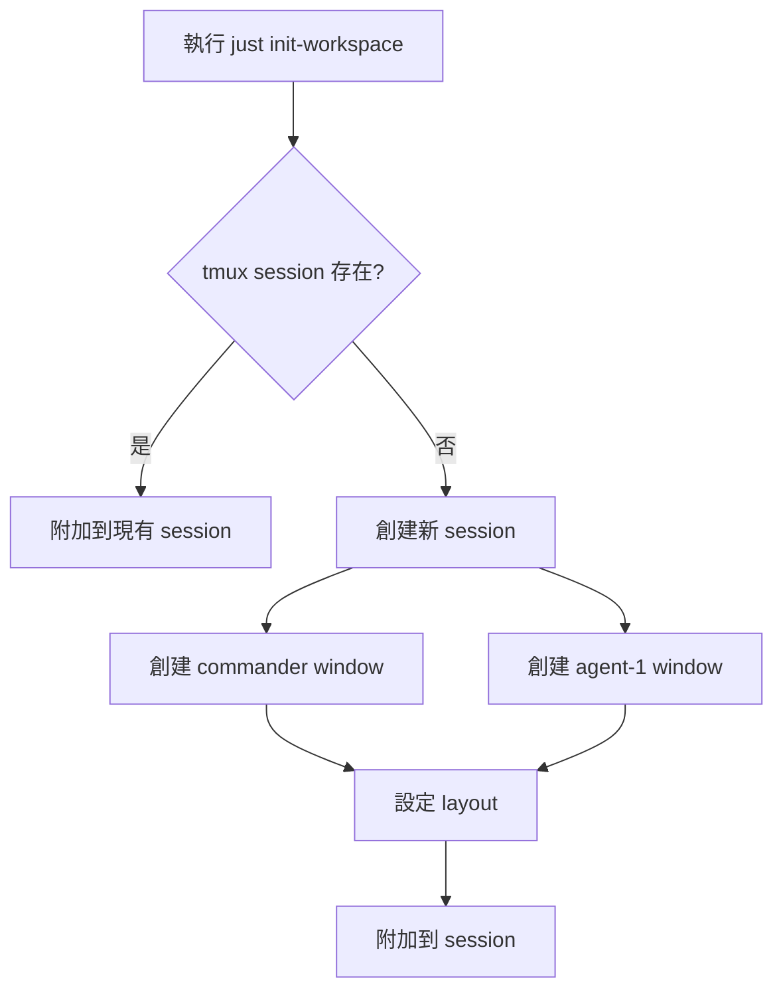
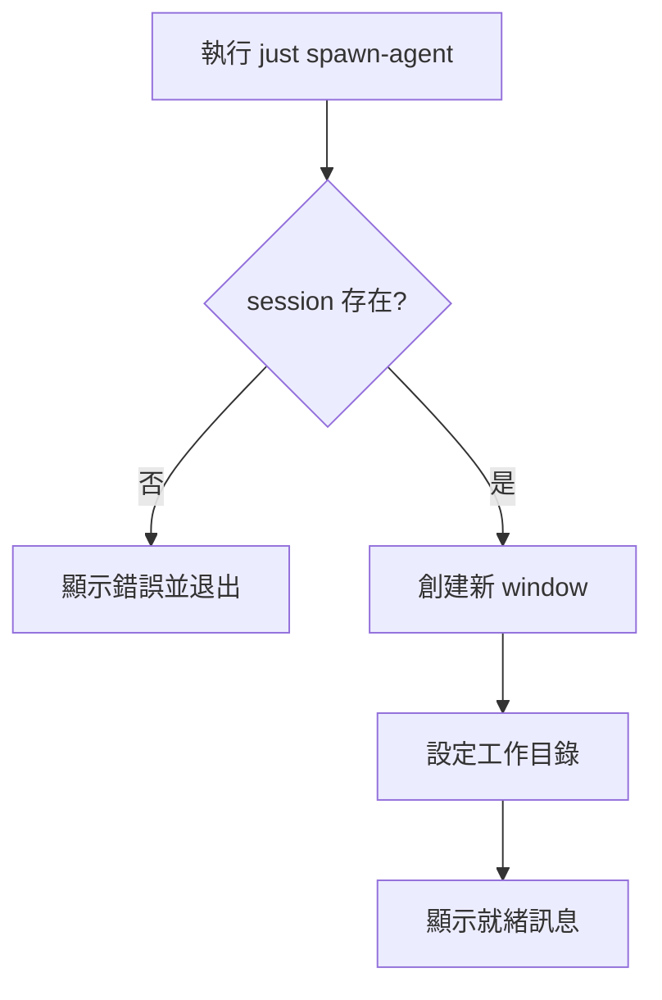
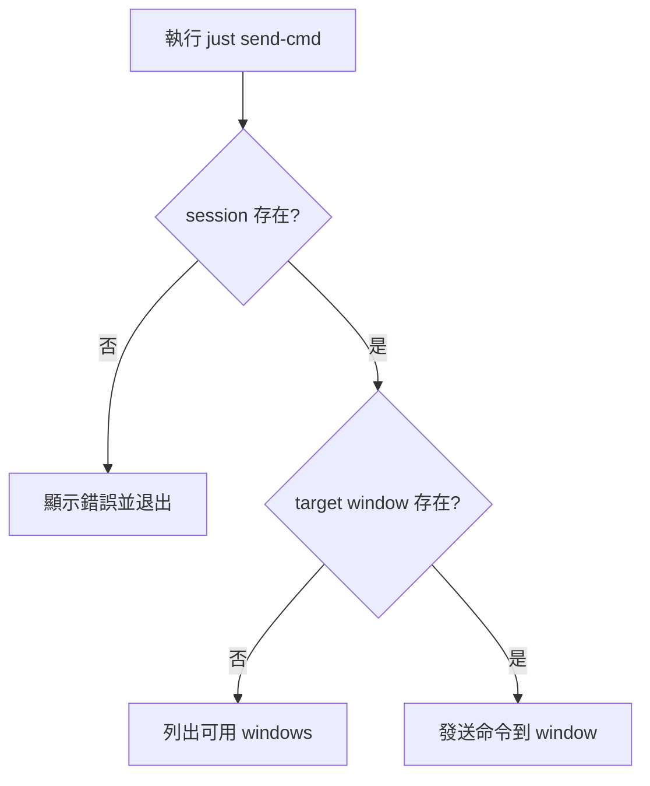

# Agent Workspace 架構文檔

本文檔描述 Agent Workspace 的技術架構和設計決策。

## 📐 系統架構

### 組件概覽

```
┌─────────────────────────────────────────────────────────┐
│                    tmux Session                          │
│                   "agent-workspace"                      │
│                                                          │
│  ┌──────────────┐  ┌──────────┐  ┌──────────────────┐  │
│  │  Commander   │  │ Agent-1  │  │     Agent-N      │  │
│  │   (指揮官)   │  │ (開發者) │  │   (研究員/其他)   │  │
│  │              │  │          │  │                  │  │
│  │  - 協調      │  │  - 實作  │  │   - 調研        │  │
│  │  - 分配任務  │  │  - 測試  │  │   - 文檔        │  │
│  │  - 監控      │  │  - 審查  │  │   - 實驗        │  │
│  └──────────────┘  └──────────┘  └──────────────────┘  │
│         │                 │                 │           │
│         └─────────────────┴─────────────────┘           │
│                           │                             │
│                    ┌──────▼──────┐                      │
│                    │  justfile   │                      │
│                    │  (任務調度)  │                      │
│                    └─────────────┘                      │
└─────────────────────────────────────────────────────────┘
                          │
                    ┌─────▼──────┐
                    │   YAML     │
                    │  Config    │
                    └────────────┘
```

## 🔧 技術棧

### 核心技術

| 技術 | 版本 | 用途 |
|------|------|------|
| **tmux** | 3.5a | Terminal multiplexer，workspace 管理 |
| **just** | 1.46.0 | Command runner，任務自動化 |
| **bash** | - | Shell scripting，自動化腳本 |
| **YAML** | - | 配置管理，Agent 定義 |

### 為什麼選擇這些技術？

#### tmux
- ✅ **輕量級**: 無需 GUI，純 terminal 操作
- ✅ **持久化**: Session 可分離/重連
- ✅ **靈活**: 支援多種 layout 和操作
- ✅ **自動化**: 強大的命令行控制

#### just
- ✅ **簡潔**: 比 Makefile 更簡單
- ✅ **安全**: 預防 recursive execution
- ✅ **跨平台**: Linux/macOS/Windows
- ✅ **可讀性**: 清晰的 recipe 定義

## 📁 專案結構

```
agent-workspace/
├── .github/                 # GitHub 相關配置
│   ├── ISSUE_TEMPLATE/      # Issue 模板
│   └── pull_request_template.md
├── bin/                     # 可執行腳本
│   └── start-agent.sh       # Agent 啟動腳本
├── config/                  # 配置檔案
│   └── agents.yaml          # Agent 定義
├── docs/                    # 文檔
│   ├── ARCHITECTURE.md      # 架構文檔
│   ├── LEARNING.md          # 學習筆記
│   └── ROADMAP.md           # 開發路線圖
├── logs/                    # 日誌目錄（gitignore）
├── justfile                 # 任務運行器配置
├── test-orchestration.sh    # 測試腳本
├── README.md                # 專案說明
├── CONTRIBUTING.md          # 貢獻指南
└── LICENSE                  # MIT 授權
```

## 🔄 工作流程

### 1. 初始化流程



### 2. Agent 生成流程



### 3. 命令發送流程



## 🎯 設計原則

### KISS (Keep It Simple, Stupid)
- 使用現有工具，不重新發明輪子
- 最小化依賴
- 簡單的 shell 腳本而非複雜的程式語言

### DRY (Don't Repeat Yourself)
- justfile 中的內部 recipes 共享邏輯
- 配置檔案統一管理 agent 定義

### YAGNI (You Aren't Gonna Need It)
- 只實作當前需要的功能
- 避免過度設計
- 保持 MVP 精神

## 🔐 安全考量

### Session 命名
- 使用固定名稱 `"agent-workspace"` 避免衝突
- 檢查 session 是否存在再創建

### 命令執行
- 驗證 target window 是否存在
- 錯誤處理和用戶提示

### 檔案權限
- 腳本執行權限 (`chmod +x`)
- 配置檔案只讀保護

## 📊 擴展性設計

### Phase 2: Agent 配置系統
```yaml
# config/agents.yaml
agents:
  commander:
    role: "指揮官"
    skills: [coordination, monitoring]

  agent-1:
    role: "開發者"
    skills: [feature-dev, tdd]
```

### Phase 3: 智能協作
- Agent 間通訊協議
- 共享上下文機制
- 事件驅動架構

### Phase 4: 視覺化
- Web dashboard
- 實時狀態監控
- 任務流程視覺化

## 🧪 測試策略

### 單元測試
- 每個 shell 函數的獨立測試
- Mock tmux 命令進行測試

### 集成測試
- `test-orchestration.sh` 測試完整流程
- 驗證 agent 創建和命令發送

### 手動測試
- 實際操作 tmux session
- 驗證用戶體驗

## 📚 技術參考

- [tmux 手冊](https://github.com/tmux/tmux/wiki)
- [Just 文檔](https://just.systems/man/en/)
- [Bash Best Practices](https://github.com/alexandrebebter/bash-best-practices)
- [YAML 規範](https://yaml.org/spec/)

---

**持續改進中...** 🚀
